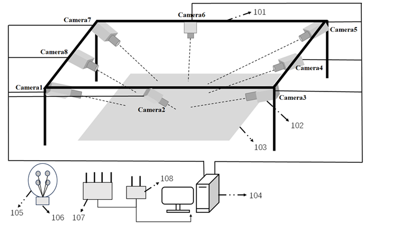
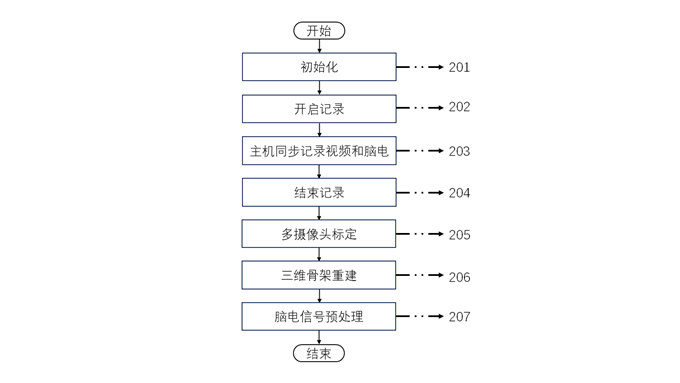

# 多摄像头脑电同步采集系统

## 项目简介  
该系统采用高帧率的八目摄像头同步采集脑电和人体行为，能够实现人体行为的无死角捕捉和三维重建。利用内存队列采集帧，实现稳定且不丢帧；利用Trigger Box串口通信，实现脑电采集设备和摄像头的高精度同步。此系统能够应用于神经科学研究、自由活动状态下的脑电信号与行为分析，并能辅助人机交互领域和脑-机接口技术开发、神经环路机制探究和辅助临床诊断等方面。

---
## 设备型号  
- 采集场所：人体行为捕捉系统，使用铝型材，尺寸为5.2x5.2x2.7米
- 相机：Intel RealSense D455 x 8，其中RGB camera的分辨率为1280x720，FPS为30(最高可达90)
- 主机：Dell台式工作站3660，CPU为12th Gen Intel(R) Core(TM) i9-12900K   3.20 GHz，RAM 128GB，带两块4口USB3.2 PCI扩展卡 
- 同步器：BRK-TPSM01-A03-多参数同步器（专业版）
- 脑电采集装置：NeuSen W 无线数字脑电采集系统 NSW364，64通道，采样频率为1000Hz
---
## Requirements  
首先需要NSW364配套的python API，and install requirements:
```python
pip install -r requirements.txt
```

---

## 装置示意图
下图为用于脑电和人体行为同步采集的硬件装置图。
- 101为不锈钢铁架，可固定在任意天花板、板材等顶部，也可放置在地面上，方便拆卸，其尺寸为非固定值，可根据实际需求调整。
- 102为8个同种型号的摄像头模组，均为USB3.0接口。八摄像头中，四个摄像头安装在摄像头固定架的四个柱子中部，其朝向为水平方向，微斜向下；另外四个摄像头安装在四个角落，保证摄像头视野中捕捉到完整的人体行为信息。
- 103为拍摄平面，人体在拍摄平面内进行自由活动或者按照实验范式完成实验任务。
- 104为主机，用于控制整个采集系统，完成视频的录制和存储、脑电的采集和存储、视频和脑电的同步控制等任务。
- 105为脑电帽，包括无创脑电电极、电极线和起固定作用的帽子，用于采集脑部活动产生的微弱电信号。
- 106为无线脑电放大器，用于获取脑电电位信息，将放大的信号通过无线方式传输到接收设备，置于脑电帽后端，可在接口吻合的情况下通过磁力固定在脑电帽上。
- 107为智能同步中心，使用网线与主机连接，智能同步中心通过 Wi-Fi 将无线脑电放大器与主机无线相连。
- 108为多参数同步器，使用USB线与主机连接，用于发送同步信号，确保脑电与视频同步采集。

  

---

## 采集流程图
下图为用于脑电和人体行为同步采集的软件流程图。
- 201为初始化。主机与智能同步中心建立TCP连接或者使用有线网络连接，主机与多参数同步器使用USB连接，主机与多摄像头的初始化连接等。
- 202为开启记录。主机启动采集控制程序，向多摄像头和脑电采集设备发送开始命令和同步信号，同步信号用于消除累积误差，摄像头每采集300帧，主机向多参数同步器发送一次同步信号。 
- 203为主机同步记录视频和脑电。采集控制程序使用多进程来管理和控制不同摄像头的录制工作。每个摄像头对应一个独立的进程来获取视频帧。主控进程通过控制触发信号的发送来协调各摄像头的同步录制。摄像头每采集300帧，采集控制程序发送一个新的触发信号，确保所有摄像头在同一时刻采集数据同时向多参数同步器发送一个trigger作为新的采集段的开始。
- 204为结束记录。当主机记录达到指定帧数或者记录达到指定时长或者收到了终止信号，采集控制程序向多摄像头和多参数同步器发送表示结束的触发信号，主机终止采集进程、释放多摄像头资源并结束采集。
- 205为多摄像头标定。标定板的棋格盘格点数为7*4，棋格盘格点大小为根据拍摄空间定制。每个摄像头拍摄200张不同角度的标定板图片，8个共计1600张，再将其上传至MATLAB工作空间中，利用StereoCameraCalibrator GUI工具箱进行定标操作，得到相机的内参外参，包括旋转矩阵R和平移向量T等，并将其保存至本地。
- 206为三维骨架重建。利用yolov8深度学习网络模型对视频进行训练和预测，进行精准的二维人体姿态估计，并利用定标后的摄像头参数，使用triangulation算法进行17个身体点三维重建。
- 207为脑电信号预处理。使用采集到的脑电信号的事件文件中记录的trigger，先对trigger序列进行正确性检查，确保串口通信时没有因为其他原因造成某几个trigger的丢失或者反转，然后根据trigger序列对脑电信号进行裁剪拼接，最终得到与八个摄像头采集的视频几乎完全同步的脑电信号，可以确保帧数误差不超过0.5%
  
  

## 联系方式  
如有问题，请联系：  
📧 邮箱：hp.lin@siat.ac.cn
